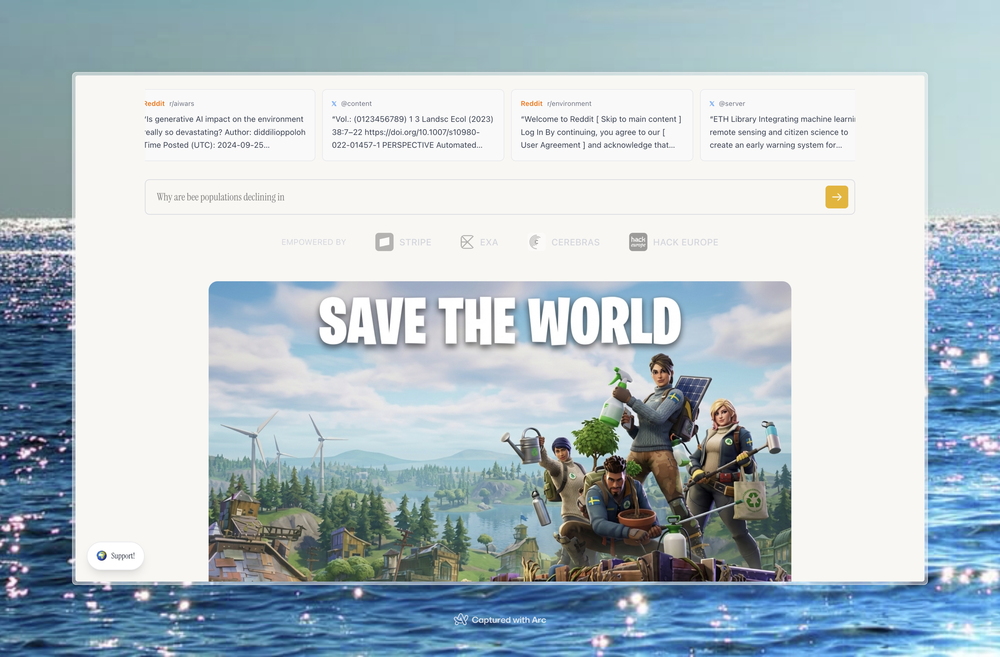
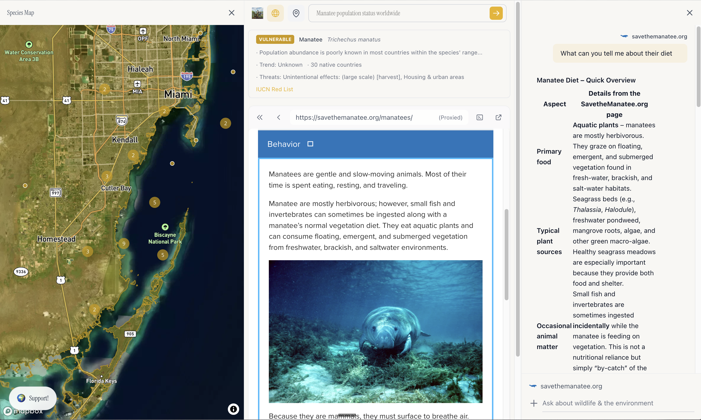
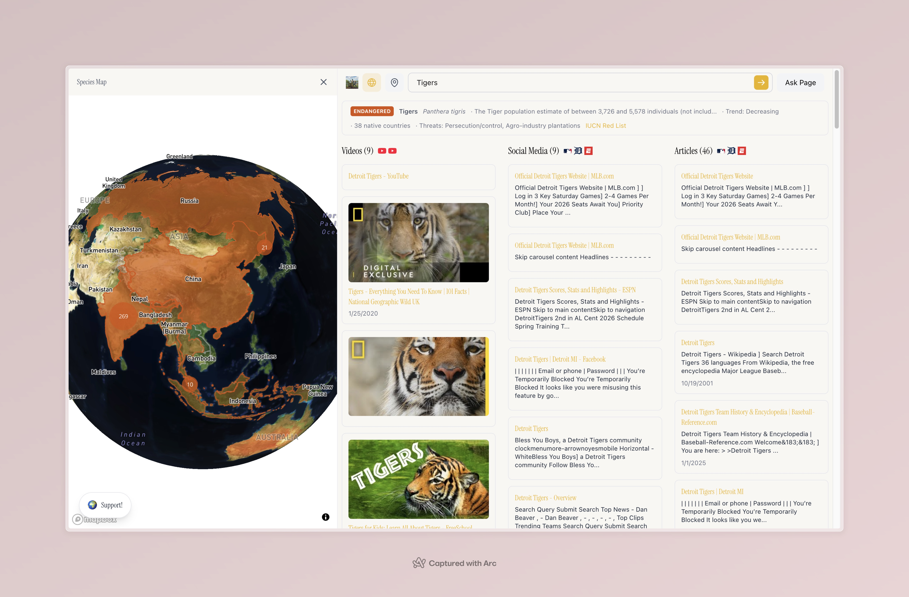
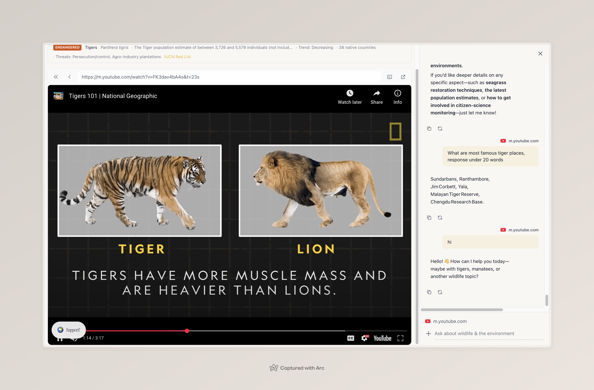

# Save the World

**AI-powered conservation intelligence.** Search, explore, and understand what's happening to our planet's wildlife — in real time.

Built for [Hack Europe](https://hackeurope.com) by a team that believes technology should serve the planet, not just shareholders.

> *"The planet is literally on fire and we're using AI to generate memes. Can we redirect some of that compute to saving ecosystems?"* — r/Futurology



---

## The Problem

Every day, species move closer to extinction. Ecosystems collapse. But the data is scattered across research papers, government databases, social feeds, and news outlets. By the time information reaches the people who care, it's already too late to act.

There is no single place where someone can type a question like *"How are bee populations doing?"* and get a real, comprehensive, data-backed answer — across science, social media, news, and conservation databases — all in one view.

## What We Built

**Save the World** is a conservation search engine that connects AI-powered web search with real scientific data to give anyone instant observability into the state of Earth's wildlife.

Type a query. Get results from YouTube, Twitter/X, Reddit, LinkedIn, news outlets, Medium, and GitHub — organized and browsable. If your query mentions a species, we automatically pull its **IUCN Red List** conservation status and plot its global habitat on a **3D interactive globe** using real observation data from GBIF.

Then ask the AI assistant anything about what you're reading.



---

## Features

### Multi-Platform Conservation Search
Search once, see everything. Results are pulled from 7+ platforms via [Exa](https://exa.ai) and organized into Videos, Social Media, and Articles. Click any result to read it in the built-in browser without leaving the app.

### Species Conservation Status
When you search for an animal, we detect the species and fetch its real conservation data from the [IUCN Red List](https://www.iucnredlist.org/):

- **Conservation category** — Least Concern to Critically Endangered, color-coded
- **Population trend** — increasing, decreasing, stable, or unknown
- **Population size** — when data is available
- **Native range** — number of countries where the species is found
- **Primary threats** — habitat loss, climate change, hunting, pollution, etc.

### Interactive Species Globe
A Mapbox-powered 3D globe that visualizes where species actually live:

- **Country highlighting** — native range countries colored by conservation status
- **GBIF observation points** — up to 300 real-world sighting records, clustered at low zoom
- **Auto-rotation** — the globe slowly spins until you interact with it



### AI Conservation Assistant
An AI chat panel (powered by [Cerebras](https://cerebras.ai)) that knows about wildlife, climate, and ecology. When you're browsing a webpage, the assistant pre-crawls it so you can ask questions about what you're reading — instantly, no waiting.



### Built-In Browser with Proxy
View any webpage directly inside the app. Sites that block iframes (BBC, CNN, NYT, Reddit, LinkedIn) are automatically proxied. Videos from YouTube, Vimeo, and TikTok play natively.

### Real-Time Social Mentions
A scrolling carousel on the homepage surfaces real conversations happening right now on Twitter/X and Reddit about conservation, climate, and endangered species — fetched live from Exa.

### Support Causes You Believe In
A built-in donation widget powered by [Stripe](https://stripe.com) lets anyone contribute directly. Apple Pay, Google Pay, and card payments supported.

---

## How It Works

```
User searches "Why are bee populations declining"
         │
         ├── Exa API ──► YouTube, Twitter, News, Reddit, LinkedIn, Medium, GitHub results
         │
         ├── Cerebras LLM ──► Detects species: Apis mellifera (Western Honey Bee)
         │
         ├── IUCN Red List API ──► Conservation status, threats, native countries
         │
         ├── GBIF API ──► 300 real observation coordinates worldwide
         │
         └── Mapbox Globe ──► Renders habitat range + observation clusters on 3D map
```

All of this happens in parallel in under 3 seconds.

---

## Tech Stack

| Layer | Technology |
|-------|-----------|
| **Framework** | Next.js 16, React 19, TypeScript |
| **Search** | [Exa](https://exa.ai) — AI-native search across 7+ platforms |
| **AI** | [Cerebras](https://cerebras.ai) — gpt-oss-120b for chat, llama3.1-8b for species detection |
| **Species Data** | [IUCN Red List API](https://apiv3.iucnredlist.org/) — conservation status, threats, range |
| **Observations** | [GBIF API](https://www.gbif.org/) — global biodiversity observation records |
| **Mapping** | [Mapbox GL JS](https://docs.mapbox.com/mapbox-gl-js/) — 3D globe with country boundaries |
| **Payments** | [Stripe](https://stripe.com) — embedded payment elements for donations |
| **Styling** | Tailwind CSS 4, Framer Motion |
| **Deployment** | Vercel |

---

## Getting Started

### Prerequisites

You'll need API keys for:

| Service | Get your key |
|---------|-------------|
| Exa | [dashboard.exa.ai/api-keys](https://dashboard.exa.ai/api-keys) |
| Cerebras | [cloud.cerebras.ai](https://cloud.cerebras.ai/) |
| Mapbox | [account.mapbox.com](https://account.mapbox.com/) |
| IUCN Red List | [apiv3.iucnredlist.org](https://apiv3.iucnredlist.org/) |
| Stripe | [dashboard.stripe.com/apikeys](https://dashboard.stripe.com/apikeys) |

### Installation

```bash
git clone https://github.com/adisinghstudent/savetheworld.today.git
cd savetheworld.today
npm install
```

### Environment Variables

Create a `.env.local` file:

```env
# Search
EXA_API_KEY=

# AI
CEREBRAS_API_KEY=

# Mapping
NEXT_PUBLIC_MAPBOX_TOKEN=

# Species data
IUCN_API_KEY=

# Payments
STRIPE_SECRET_KEY=
NEXT_PUBLIC_STRIPE_PUBLISHABLE_KEY=
```

### Run

```bash
npm run dev
```

Open [http://localhost:3000](http://localhost:3000).

---

## API Routes

| Route | Method | Description |
|-------|--------|-------------|
| `/api/exa` | POST | Multi-platform search via Exa (YouTube, Twitter, News, etc.) |
| `/api/chat` | POST | AI chat with optional webpage context (Cerebras) |
| `/api/mentions` | GET | Live social media mentions for the carousel |
| `/api/species-search` | GET | LLM-powered species name extraction from natural language |
| `/api/species` | GET | IUCN Red List conservation status lookup |
| `/api/species-occurrences` | GET | GBIF observation records with coordinates |
| `/api/proxy` | GET | CORS proxy for iframe-blocked websites |
| `/api/stripe/checkout` | POST | Create Stripe PaymentIntent for donations |

---

## Why This Matters

There are approximately **8.7 million species** on Earth. Over **1 million** are threatened with extinction. The IUCN Red List tracks 157,000+ species, and the numbers get worse every year.

Most people never see this data. It lives in academic databases, behind paywalls, in formats that require a biology degree to interpret.

We built Save the World because we believe **awareness is the first step**. If you can search for a species as easily as you search for a restaurant, and see its conservation status as clearly as a weather forecast, more people will care. And when more people care, things change.

---

## Empowered By

<p>
  <a href="https://stripe.com"><strong>Stripe</strong></a> ·
  <a href="https://exa.ai"><strong>Exa</strong></a> ·
  <a href="https://cerebras.ai"><strong>Cerebras</strong></a> ·
  <a href="https://hackeurope.com"><strong>Hack Europe</strong></a>
</p>

---

## Contributing

This is open source. If you care about conservation and know how to code, we'd love your help.

- Open issues for bugs or ideas
- Submit PRs with improvements
- Help us add more data sources (eBird, Ocean Biodiversity, satellite imagery)
- Improve species detection accuracy
- Add more conservation organizations to support

---

## License

MIT
